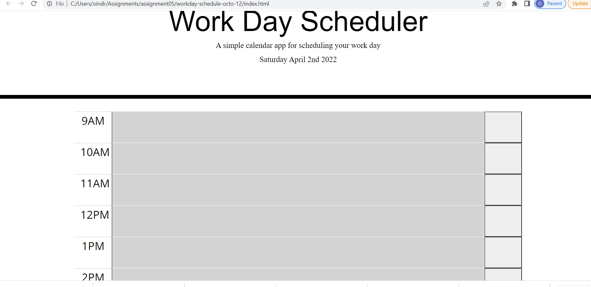

## workday-scheduler

This website is built for people to plan and write everyday schedule.

## Methods Used :
1.jQuery
2.HTML
3.Css
3.Moment.js
4.Bootstrap

## Future goals:
1.Update to make the website responsive
2.Add local storage to store tasks

## Screenshot

## Deplyed link
[find the deployed link to the website here](https://oindrila11.github.io/workday-schedule-octo-12/)

## License & Copyright

© Oindrila Talukder, University of Toronto Web Developer.

Licensed under the [MIT License](LICENSE.md)